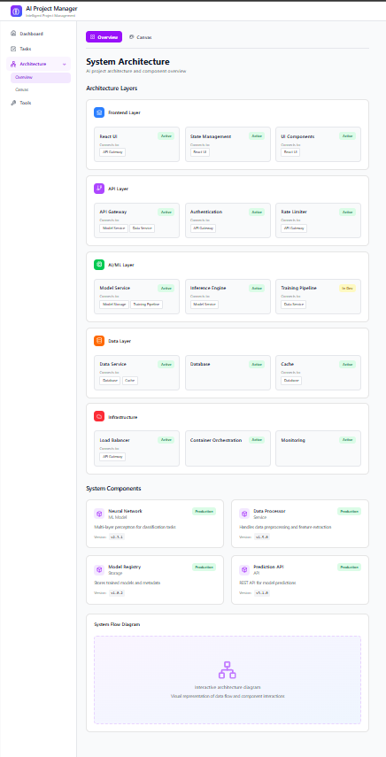

# Project Tasks

## What This Is

A browser-based reconciliation tool that automates cross-referencing of invoices, receipts, and bank statements against entries in Sage for Accountants (desktop, LAN-hosted). It consists of two main modules: **Ledger Link** (management interface with dashboard, reconciliation UI, and document archive) and **DOC·SCAN** 

## Core Value

Accountants can import a bank statement and instantly see which transactions match Sage entries and which need attention — eliminating the manual hunt through Sage for every line item.

## Requirements

### Validated

(None yet — ship to validate)

### Active

- [ ] Pedir Glossário
- [ ] Pedir PDF fatura exemplo e Pedir output real fatura para comparar com testes 
- [ ] Pedir demos e acessos (caso existam demos e acessos para poder ver a base dados atual e os restantes sistemas e integrações) 
 
Questões Técnicas
- [ ] Atual arquitetura processo As Is (tools, APIs, ...) 
- [ ] Licenças dos trabalhadores (Microsoft, Sage, ?) 
- [ ] Network integration / configuration ? 
        - [ ] Protocolos comunicação 
- [ ] Se recebem as faturas por email? Ou apenas na plataforma? 
        - [ ] Regras para olhar para o tipo de ficheiros e quais os tipos que são aceites 
- [ ] Aceder ao Sage DB ou À API deles? 
- [ ] Existe SAGE DB for accountants (portal interno e externo) e também desktop para gestão interna da empresa? 
- [ ] Sage é web app ou versão desktop? 
- [ ] Quantas faturas processam por dia? 
- [ ] Existe base de dados middleware?
- [ ] Controlar estado faturas Diferentes estados que uma fatura pode ter? E mesmo entre sistemas? 
- [ ] Qual o campo ou combinação de campos para Primary Key?

- [ ] Documentos guardados na plataforma SAGE tÊm conversão automática para PDF?
- [ ] É utilizado Arquivo Digital Cloud (Bizdocs)? 
- [ ] É utilizado e-fatura Connection? 
- [ ] É utilizado Ambiente Hosted?

- [ ] Regras + glossário e faturas exemplo por tipo ["Fatura","Recibo", "Extrato Bancário] 
- [ ] Mapeamento campos / glossário dentro dos documentos 
- [ ] Como são processadas as notas de crédito? 

- [ ] Grau de confiança? (Regras ou notificações associadas abaixo de um determinado valor) 
- [ ] Intregação com outros sistemas? 

- [ ] Se recebe faturas internacionais? Ou só de Portugal e Angola?

- [ ] Pedir workflow com diferentes etapas e sistemas

### Out of Scope (To be Defined)

- Auto-creating missing transactions in Sage — v1 is read + reconcile only
- Cloud hosting or external access — runs entirely on the LAN
- Mobile-specific UI — desktop browsers on the LAN are the target
- Real-time sync with Sage — batch import/reconcile workflow
- Multi-currency matching — adds significant complexity, defer to v2+
- User authentication — trusted LAN, single firm

## Context

- **Sage for Accountants** is a Windows desktop application on the LAN. Integration is via the official .NET/Interops SDK for read/write access to transactions, invoices, and bank entries.
- **Portuguese accounting context**: NIF (tax ID), IBAN, IVA (VAT), SAF-T compliance are first-class data points. Documents include Portuguese invoices, receipts, and bank statements.
- **DOC·SCAN module** handles document ingestion. Uses a local vision model (e.g., Florence-2, DocTR) running on the LAN server for OCR — no cloud API costs, fully on-premises. Assigns confidence scores (high/medium/low) per extraction.
- **Document sources are mixed**: some clients provide digital PDFs and CSV bank exports; others bring scanned paper documents.
- **Target users are Portuguese accountants** at a small firm managing under 10 client companies in Sage. Batch-oriented workflow.
- **Reconciliation rules are strict**: exact match (to the cent), approximate match (≤2% tolerance for fees/rounding/shipping), no match (>2% or missing).

## Constraints

- **Platform**: Backend must run on Windows (Sage SDK is Windows-only)
- **Network**: LAN-only deployment; server has internet access for model downloads but runtime is local
- **Sage version**: Sage for Accountants (desktop), accessed via .NET/Interops SDK
- **Runtime**: Node.js backend, browser-based frontend
- **OCR**: Local vision model on LAN server — no per-page API costs
- **GPU**: LAN server needs a capable GPU for local vision model inference

## Key Decisions

| Decision | Rationale | Outcome |
|----------|-----------|---------|
| Browser-based over desktop app | Avoids per-machine installs, easier to maintain | — Pending |
| Sage .NET/Interops SDK (Option A) | Official SDK, supports read + write; ODBC and SAF-T deferred to v2 | — Pending |
| Local vision model for OCR | Zero per-page cost, fully on-premises, no cloud dependency | — Pending |
| Reconcile-only (no auto-create in Sage) | Lower risk for v1; accountants verify before any Sage writes | — Pending |
| Portuguese-first field extraction | NIF, IBAN, IVA are mandatory fields for PT accounting workflows | — Pending |
| Strict matching rules (exact / ≤2% / no match) | Mirrors real-world accounting tolerance for fees and rounding | — Pending |

---
*Last updated: 2026-03-17 after questioning*

